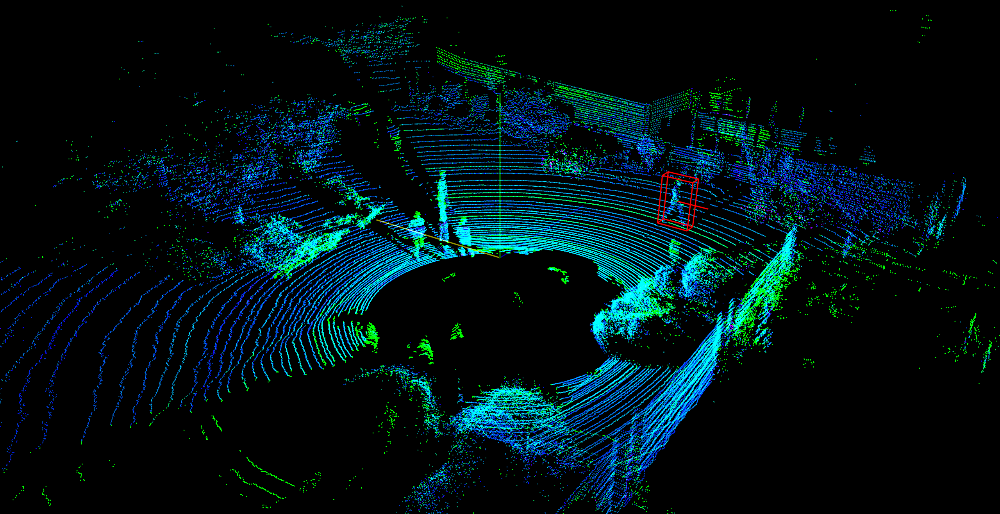

# KITTI 3D Velodyne point clouds visualization
This repo is implementation for KITTI dataset visualization in python.

It is tested with python 3.8.

# Download data and running

You can download the KITTI Dataset from http://www.cvlibs.net/datasets/kitti/raw_data.php

The directory structure is as follow
```
└─KITTI Dataset path
    ├─testing
    │  ├─calib
    │  ├─image_2
    │  └─velodyne
    └─training
        ├─calib
        ├─image_2
        ├─label_2
        └─velodyne
```

runnning
```
python 3dpc_target_visual.py --dataset <dataset_path> --file_index <file_index>
```
# Performance




