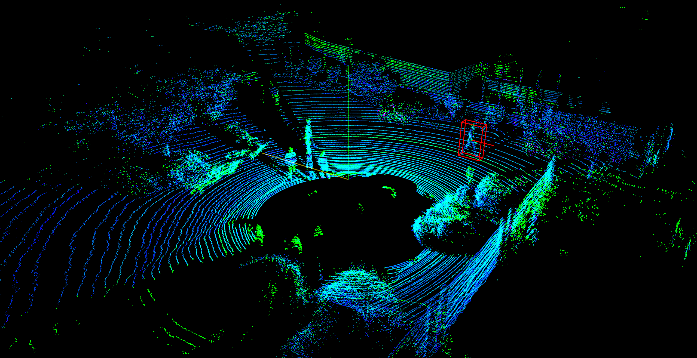
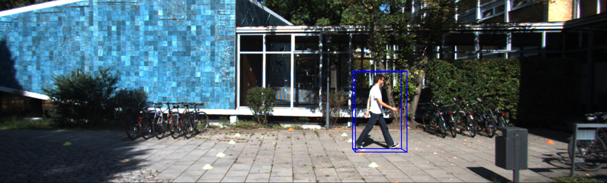
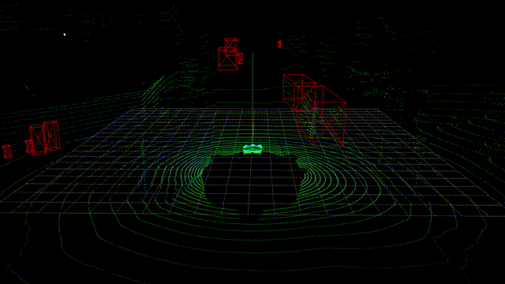

# LiDAR Datasets point clouds visualization
This repo is a visualization implementation for KITTI dataset, Waymo open dataset and nuScense dataset in python.

It is tested with python 3.9.
# Preparation
* Environments  
```
pip install -r .\requirements.txt
```
To use nuScenes dataset 
```
pip install nuscenes-devkit==1.1.9
```

To use waymo open dataset
```
pip install tensorflow==2.5.0 -i https://pypi.org/simple/
```

# Custom Data
You can easily visualize your point clouds and bounding box by this repo with Nx3 (Nx4 if with intensity) np.array for point clouds and Nx7 np.array for 3d bounding boxes.
There is a demo that can be a reference

```
python demo.py
```

# KITTI Dataset
## Download data and running

You can download the KITTI Dataset from http://www.cvlibs.net/datasets/kitti/raw_data.php

The directory structure is as follow
```
└─KITTI Dataset path
    ├─testing
    │  ├─calib
    │  ├─image_2
    │  └─velodyne
    └─training
        ├─calib
        ├─image_2
        ├─label_2
        └─velodyne
```

runnning
```
python kitti_vis_single.py --dataset <dataset_path> --file_index <file_index>
```
## Performance





# Waymo open Dataset
You can download the Waymo Open Dataset from https://waymo.com/open/data/perception/

Then you can visualize single tfrecord file as follow

```
python waymo_vis_sequence.py --filepath <tfrecode_file_path>
```


# nuScense Dataset
You can download the nuScense Dataset from https://www.nuscenes.org/download

The directory structure is as follow
```
└─nuScense Dataset path
    ├─maps
    ├─samples
    ├─sweeps
    │  ├─LIDAR_TOP
    │  ├─...   
    ├─v1.0-trainval
    ...

```
runnning
```
python nuscense_vis_sequence.py --rootpath <nuScense_root_path>
```



